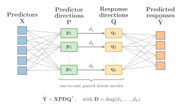

# Π-PLS: A compact and interpretable model with paired latent directions

## Overview

**Panoramic partial least squares (Π-PLS)** is a data-driven multivariate regression method for
predicting multiple responses from correlated, potentially high-dimensional predictors. It is
particularly suited to process data, where it can support both property prediction and
interpretation of predictor–response relationships. `pipls` provides a scikit-learn-style Python
implementation for model selection, prediction, and interpretation.

Across the synthetic experiments and real-world datasets examined in the accompanying study,
Π-PLS achieved competitive or better predictive performance relative to standard PLS at a fixed
component count. In other words, Π-PLS attains comparable predictive performance with fewer latent
components, yielding a more parsimonious model. Each latent mode links one predictor direction to
one response direction through a non-negative coupling strength, supporting both prediction and
direct, mode-wise interpretation.

## Why Π-PLS?

- **Prediction and interpretation in one structure.** The factorization
  $\widehat{\mathbf{Y}}=\mathbf{X}\mathbf{P}\mathbf{D}\mathbf{Q}^{\top}$ provides both the
  prediction model and the basis for examining predictor directions, response directions, mode
  strengths, and regression coefficients.
- **Compact representation.** Π-PLS expresses the predictive relationship through a smaller set
  of paired latent modes.
- **Direct mode-wise interpretation.** Each latent mode links one predictor direction to one
  response direction through a non-negative coupling strength, making the fitted relationship easy
  to inspect mode by mode.

## How it works

1. **Retain a predictor panorama.** An SVD of the predictor matrix $\mathbf{X}$ defines a
   rank-controlled predictor basis $\mathbf{\Pi}$ and the corresponding retained scores
   $\mathbf{Z}=\mathbf{X}\mathbf{\Pi}$, where $r_\pi$ controls the dimension of the retained
   predictor representation.
2. **Identify the response-linked latent relation.** The default construction identifies an
   $h$-dimensional response subspace from the cross-covariance between $\mathbf{Z}$ and
   $\mathbf{Y}$, then estimates the reduced regression map by least squares.
3. **Form paired latent modes.** Diagonalizing that map produces orthonormal predictor directions
   $\mathbf{P}$, orthonormal response directions $\mathbf{Q}$, and the non-negative diagonal
   coupling matrix $\mathbf{D}$.

The two rank controls satisfy $h \leq r_\pi$, where $r_\pi$ governs the breadth of the retained
predictor representation, while $h$ is the component count, i.e., the size of the final paired
model. The [theory overview](docs/theory.md) gives the complete derivation.

## Documentation

The [rendered documentation](https://stefanlindstroem.github.io/pipls/) covers installation,
model selection, validation, prediction, interpretation, theory, and the public API. New users can
begin with the installation guide and quick-start tutorial, then move to the complete examples and
reference material.

- [Installation](docs/installation.md) — create an isolated environment and install the package.
- [Quick start](docs/tutorials/quick_start.md) — move from an included dataset to a fitted model and
  prediction diagnostics.
- [Tutorials and examples](docs/examples.md) — follow complete workflows for model selection,
  validation, and interpretation.
- [Theory](docs/theory.md) — study the mathematical construction and paired latent modes.
- [API reference](docs/api/index.md) — inspect the public estimator, search, dataset, and result
  interfaces.

## Contributing and development

We welcome contributions and feedback. Before submitting a substantial change, please
[open an issue](https://github.com/stefanlindstroem/pipls/issues) or
[start a discussion](https://github.com/stefanlindstroem/pipls/discussions) so that the
proposal can be reviewed and coordinated. Pull requests should link to the corresponding issue or
discussion.

Π-PLS is developed using a structured, human-guided workflow with LLM assistance. Human maintainers
retain responsibility for scientific and software decisions, and all LLM-assisted changes are
reviewed and validated before inclusion. See [CONTRIBUTING.md](CONTRIBUTING.md) for contributor
guidance; coding assistants should begin with [`AGENTS.md`](AGENTS.md).

## Citation and license

If you use Π-PLS, please cite the companion article as described in the
[citation guide](docs/citation.md);
[`CITATION.cff`](CITATION.cff) provides the same citation in
machine-readable form. Π-PLS is distributed under the [BSD 3-Clause License](LICENSE). Included
reference datasets retain their own licensing and attribution terms.
