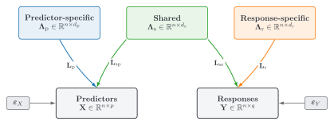

# Datasets and generators

`pipls.datasets` provides three packaged real-data loaders, a validated dataset record, and a
deterministic synthetic generator. Ordinary arrays and data frames passed directly to `fit(X, y)`
remain the normal interface for user data.

## Packaged datasets

The package includes Pulp, Sugarcane, and Tobacco as installed resources. Loading performs no
network access or preprocessing. The [Reference datasets](../datasets.md) page owns provenance,
licensing, adaptation, and matrix-dimension details.

::: pipls.datasets.load_pulp
    options:
      members: false

::: pipls.datasets.load_sugarcane
    options:
      members: false

::: pipls.datasets.load_tobacco
    options:
      members: false

## Synthetic generator

The generator distinguishes three latent roles. Its data model is

\begin{equation}
\mathbf{X}
=
\boldsymbol{\Lambda}_{\mathrm{p}}\mathbf{L}_{\mathrm{p}}
+
\boldsymbol{\Lambda}_{\mathrm{s}}\mathbf{L}_{\mathrm{sp}}
+
\boldsymbol{\varepsilon}_{\mathrm{X}},
\qquad
\mathbf{Y}
=
\boldsymbol{\Lambda}_{\mathrm{s}}\mathbf{L}_{\mathrm{sr}}
+
\boldsymbol{\Lambda}_{\mathrm{r}}\mathbf{L}_{\mathrm{r}}
+
\boldsymbol{\varepsilon}_{\mathrm{Y}}.
\end{equation}

The figure illustrates this equation: predictor-specific directions contribute only to
$\mathbf{X}$, shared directions contribute to both $\mathbf{X}$ and $\mathbf{Y}$, and
response-specific directions contribute only to $\mathbf{Y}$. Independent noise is added to the two
observed blocks.

{ style="width: 100%; height: auto;" }

`n_predictor_specific`, `n_shared`, and `n_response_specific` set the three latent dimensions.
Every latent-score and loading entry is an independent standard-normal draw. Predictor and response
noise entries are independent Gaussian draws with the requested standard deviations. The generator
applies no centering, score standardization, loading orthonormalization, latent-strength scaling, or
observed-variable scaling.

`make_synthetic_data()` returns only the generated `X` and `Y` arrays. A fixed `random_state` and
identical arguments reproduce the same arrays for a given package implementation; internal random
draw order is not public API. The [companion-manuscript synthetic-data](../manuscript_reproduction.md)
page owns publication-specific reproduction requirements, while the
[synthetic tutorial](../tutorials/synthetic.md) shows a worked train/test analysis using an explicit
row split.

::: pipls.datasets.make_synthetic_data
    options:
      members: false

## Dataset container

::: pipls.datasets.PiPLSDataset
    options:
      members:
        - n_samples
        - n_features
        - n_targets
