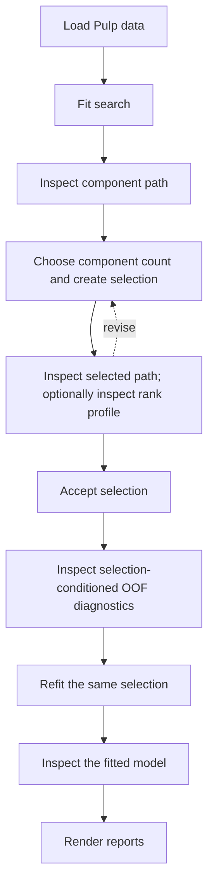

# Pulp: a complete Π-PLS workflow

This tutorial showcases a complete Π-PLS workflow applied 
to a real multivariate dataset. It assumes that `PiPLSSearchCV`, `component_path_`, and fixed-model
fitting are already familiar from [Inspect a manually selected Π-PLS model with synthetic data](synthetic.md). The focus is what changes with real data: an interior predictor-rank
result, selection-conditioned out-of-fold (OOF) predictions, and interpretation of an accepted
model.

For ordinary programming use, Π-PLS can be approached like PLS: the main model-complexity
parameter is the paired-mode count $h$ (`n_components`). A **component path** is the
one-dimensional sequence of cross-validated prediction errors obtained as $h$ is varied. For each
$h$, the search also resolves the retained predictor rank $r_\pi$ internally, so users do not normally
need to tune it as a second parameter. Advanced users can inspect or constrain $r_\pi$ when the scientific
question or available sample support makes that useful.

The workflow is to load the [Pulp data](../datasets.md#pulp-real-data-integration), fit the search,
inspect the component path, choose a component count and create one selection, inspect the selected
path and optionally the conditional predictor-rank profile, accept that selection, inspect its
selection-conditioned OOF diagnostics, refit the same selection, inspect the fitted model, and
render the reports. If the path or conditional rank evidence is unsatisfactory, return to the
selection step before proceeding to OOF diagnosis or refitting.



## Setup

Install the example dependencies before running the analysis from a source checkout:

```bash
python -m pip install ".[examples]"
```

The example imports the estimators, repeated cross-validation, numerical inspection functions,
Matplotlib, and a local biplot helper, then defines the output location and validation splitter. The
helper handles optional `textalloc` use internally:

```python
--8<-- "examples/04_pulp_real_data.py:pulp-tutorial-setup"
```

## The data and modeling question

The package-owned dataset contains 46 thermomechanical-pulp samples, 14 fiber-description
predictors, and eight responses comprising Canadian Standard Freeness and seven handsheet
properties. `load_pulp()` reads the installed resources without network access. The matrices are
adapted from supplementary material associated with Lindström et al. (2025). See the
[dataset description](../datasets.md#pulp-real-data-integration) and the [reference](#reference) for
provenance.

Predictor labels retain the source notation: `L` is contour length, `W` is width, `C` is curl, and `F` is fibrillation. The suffixes `arith`, `lw`, and `llw` denote
arithmetic, length-weighted, and length-length-weighted means. The response labels are `CSF`
(Canadian Standard Freeness), `Density`, `TI` (tensile index), `Elongation` (strain at break), `TEA` (tensile
energy absorption), `TSI` (tensile stiffness index), `Tear index`, and `s` (light-scattering
coefficient).

The final accepted analysis below uses three paired latent modes. Its predictor rank is resolved
conditionally by the search at that component count rather than chosen as a routine second tuning
parameter. The distinction is summarized in
[Interpretation of the ranks](../theory.md#interpretation-of-the-ranks).

## Load the data

The named loader returns immutable matrices together with scientific predictor and response labels:

```python
--8<-- "examples/04_pulp_real_data.py:load-pulp-data"
```

The resulting arrays have shapes `(46, 14)` and `(46, 8)`. The same loader works from a source
checkout, wheel, or source distribution and applies no preprocessing.

## Fit the search and inspect the component path { #retrieve-selection-evidence }

Fit the search and retrieve the conditioned component path without creating a selection:

```python
--8<-- "examples/04_pulp_real_data.py:inspect-pulp-component-path"
```

The search evaluates admissible paired-mode counts $h$ and conditionally retains one predictor
rank $r_\pi$ at each count. The resulting `component_path_` is therefore the PLS-like,
one-parameter view: cross-validated prediction error versus `n_components`, with the internal
predictor-rank choice already incorporated into each row.

This analysis uses ten repeated five-fold partitions, so every evaluated candidate is assessed on 50
materialized validation splits. These search-owned results can be inspected without fitting a final
model.

Define a local component-path plotter once, then render the path before fixing a component
count:

```python
--8<-- "examples/04_pulp_real_data.py:define-pulp-component-path-plotter"
```

```python
--8<-- "examples/04_pulp_real_data.py:plot-pulp-component-path"
```


The mean CV-MSE falls substantially through three components and is nearly flat thereafter. The
bars show one population standard deviation across the materialized validation splits on either
side of each mean. They describe split-to-split variability; they are not confidence intervals and
do not enter selection.

## Choose the component count and create the selection

After inspecting the path, identify the elbow point, record the corresponding count, and create the immutable selection:

```python
--8<-- "examples/04_pulp_real_data.py:choose-pulp-selection"
```

Manual selection is not the only supported component-count rule. The statement
`search.select(rule="best_score")` would return the conditioned path row with the best configured
score, while `search.select(rule="minimum_cv_mse")` would return the smallest component count within
the supplied relative and absolute tolerances of the exact path minimum. With the default scorer,
maximizing the configured score is equivalent to minimizing mean response-standardized CV-MSE.

## Inspect the selected path and optional conditional rank profile

Retrieve the predictor-rank evidence conditional on the chosen component count. This is optional
advanced inspection; the same `path` object is reused for the selected presentation:

```python
--8<-- "examples/04_pulp_real_data.py:inspect-pulp-selected-evidence"
```

The selected path is numerically identical to the first path; the second presentation adds the
orange chosen-row marker. The profile exposes the evaluated predictor ranks at the selected
component count.

### Selected component path

```python
--8<-- "examples/04_pulp_real_data.py:plot-pulp-selected-component-path"
```


The orange diamond marks the three-component selection, which is also associated with a certain predictor rank which was selected internally.

### Optional: conditional predictor-rank profile

```python
--8<-- "examples/04_pulp_real_data.py:plot-pulp-rank-profile"
```


Most users can stop at the component path. Advanced users can inspect this profile because
Π-PLS exposes the second parameter $r_\pi$. With the default scorer,
`profile.reference_selection` identifies the exact minimum-CV-MSE predictor rank at the chosen
$h$, whereas `profile.selection` identifies the smallest evaluated rank admitted by the configured
predictor-rank tolerance. The default relative tolerance is at machine scale, so these normally
coincide; both are rank 9 in this analysis.

For these 46 observations and 14 predictors, the default search is exhaustive over the complete
fold-feasible predictor-rank domain, from 3 through 14 at the selected $h=3$. Alternative ways to
restrict or fix predictor rank are advanced configuration choices and are documented separately in
[Predictor-rank policies](../path_selection.md#predictor-rank-policies).

The selected path and optional conditional rank profile are the model-selection evidence used in
this tutorial. If they make the chosen component count unsatisfactory, revise
`CHOSEN_N_COMPONENTS` and create a new selection here. Once the selection is accepted, keep it
fixed through OOF diagnosis and final refitting.

## Inspect selection-conditioned OOF behavior

The OOF report consumes the exact selection already inspected above rather than resolving the
component count again:

```python
--8<-- "examples/04_pulp_real_data.py:pulp-oof-predictions"
```

`oof_report()` reuses the same cross-validation splits that were used to evaluate the component path
and recomputes OOF predictions for the selected model. Under the repeated cross-validation protocol used here,
each observation is predicted once in each of the ten repetitions. The report therefore combines ten
OOF predictions for each observation into a single averaged prediction and records a prediction count of ten.
Because the folds are shuffled using a fixed random seed, the procedure is reproducible while remaining independent of the original observation order.

Convert those predictions to an immutable diagnostic result before refitting:

```python
--8<-- "examples/04_pulp_real_data.py:pulp-oof-inspection-results"
```


### Observed versus predicted

```python
--8<-- "tools/render_pulp_tutorial.py:render-pulp-observed-vs-predicted"
```


The response series differ in how tightly they follow the identity line. The figure shows all eight
responses, and every series remains selection-conditioned rather than an independent-test result.

See [Observed versus predicted](../model_inspection.md#observed-versus-predicted).

### Residual versus predicted

```python
--8<-- "tools/render_pulp_tutorial.py:render-pulp-residuals-vs-predicted"
```


No dominant global curvature is apparent across the displayed responses. The zero line is
descriptive; it does not establish a formal variance model or calibration claim.

See [Residuals versus predicted](../model_inspection.md#residuals-versus-predicted).

### Response-wise OOF *R*²

```python
--8<-- "tools/render_pulp_tutorial.py:render-pulp-oof-response-r2"
```


Response-wise $R^2$ summarizes how closely the selection-conditioned OOF predictions reproduce
each observed response. Values near 1 indicate strong agreement, $R^2=0$ corresponds to the
observed-mean reference, and negative values indicate prediction poorer than that reference. The
values are calculated from the averaged OOF predictions above; they are not averages of fold-wise
$R^2$ values.

See [Response-wise coefficient of determination](../model_inspection.md#response-r2).


## Refit the accepted selection

After the selection has been accepted and its optional OOF diagnostics inspected, fit the exact
same selection on all 46 development observations:

```python
--8<-- "examples/04_pulp_real_data.py:fit-pulp-model"
```

`refit(selection=selection)` fits its fixed component and predictor ranks, and attaches the
exact immutable object as `model.selection_` after fitting succeeds. The returned
[`PiPLSRegression`](../api/regression.md#pipls.PiPLSRegression) supplies predictions and fitted-model
inspection.

## Compute immutable fitted-model results

The fitted estimator is converted to numerical result objects before the fitted-model figures are
rendered:

```python
--8<-- "examples/04_pulp_real_data.py:pulp-fitted-model-inspection-results"
```

| Result | Question answered |
|---|---|
| `LatentStructure` | How are samples and variables represented by the fitted PLS-family model? |
| `PiPLSDisplayFactors` | What are the Π-PLS-specific $\mathbf{P}$, $\mathbf{D}$, $\mathbf{Q}$, and $\mathbf{Q}\mathbf{D}$ factors? |

Each paired latent mode has an arbitrary overall sign: reversing the matching columns of
$\mathbf{P}$ and $\mathbf{Q}$ leaves the fitted regression map unchanged. For interpretation, this
sign indeterminacy is normally resolved by choosing a deterministic, canonical display orientation.
Tensile index (`TI`) is commonly treated as a key handsheet quality property in pulp applications,
so this tutorial uses
`response_names.index("TI")` to orient the displayed components toward positive TI. The same
orientation is applied to the paired predictor directions, giving the factor plots a consistent
reference for interpretation.

At this point all numerical analysis is complete. The remaining fitted-model code only renders
completed public result objects. The full catalogue is in
[Model inspection](../model_inspection.md).

## Interpret representative fitted-model plots

With the display orientation fixed, the remaining figures provide two complementary views of
the fitted model: the usual PLS-family latent structure and the Π-PLS-specific pairing of predictor
and response directions. Read the figures comparatively, using relative patterns within and across
paired components rather than treating individual plotted entries as standalone effects.

### Standard PLS-family latent structure

#### Score-loading biplot

`biplot_coordinates()` supplies the balanced numerical coordinates, and one local plotting helper
renders the score-loading biplot:

```python
--8<-- "tools/render_pulp_tutorial.py:render-pulp-biplot"
```


The helper is local to the example; the reusable Pi-PLS interface is `biplot_coordinates()`. It uses
ordinary Matplotlib when `textalloc` is unavailable. When `textalloc` is installed, predictor labels
are placed to avoid one another and the predictor-arrow shafts; sample scores are intentionally not
treated as obstacles. The numerical biplot coordinates are identical in both cases.

The three length descriptors point in closely similar directions in the displayed plane, while
`Shives` contrasts with several C descriptors. These are loading-pattern relationships under the
chosen biplot scaling, not regression coefficients or formal variable importance.

See [Score-loading biplot](../model_inspection.md#score-loading-biplot) and
[`biplot_coordinates()`](../model_inspection.md#pipls.inspection.biplot_coordinates).

### Π-PLS-specific factorization

#### Predictor directions

The grouped bars are constructed directly from `factors.predictor_directions`:

```python
--8<-- "tools/render_pulp_tutorial.py:render-pulp-predictor-directions"
```


The dominant entries differ by component: the first direction emphasizes `Shives` and selected
fibrillation or length descriptors, the second emphasizes length descriptors, and the third is
strongly associated with `Fines B`. Only relative within-component patterns should be interpreted;
the signs follow the TI-positive display convention defined above.

The columns of $\mathbf{P}$ are orthonormal predictor directions, and the corresponding columns of
$\mathbf{Q}$ are orthonormal response directions. The diagonal matrix $\mathbf{D}$ pairs and
scales these directions in $\mathbf{P}\mathbf{D}\mathbf{Q}^{\mathsf T}$. The predictor directions
are distinct from ordinary X loadings. The figure shows all three selected paired latent modes;
predictor rank 9 does not create nine plotted modes. See
[Predictor directions](../model_inspection.md#predictor-directions) and
[Diagonal latent coupling](../theory.md#diagonal-latent-coupling).

#### Weighted response directions

The grouped bars are constructed directly from `factors.weighted_response_directions`:

```python
--8<-- "tools/render_pulp_tutorial.py:render-pulp-weighted-response-directions"
```


The first component has its largest absolute entries for `TI`, `TEA`, `Tear index`, and `TSI`.
The second component is most pronounced for `Density`, `Tear index` and `s`, while the third contrasts `CSF`, `Tear index`,
and `Elongation`. Because column $k$ of $\mathbf{Q}\mathbf{D}$ is $D_kQ_{:k}$, it combines each
response direction with the dilation of its paired latent mode and shows direction and strength.

The complete example includes separate $\mathbf{D}$ and $\mathbf{Q}$ plots in the same
four-panel Π-PLS factorization figure. See [Dilation](../model_inspection.md#dilation),
[Response directions](../model_inspection.md#response-directions), and
[Weighted response directions](../model_inspection.md#weighted-response-directions).

## Inspect the final fitted model

The selection-conditioned OOF section above asks how the accepted selection behaves under the
stored validation splits, including response-wise OOF $R^2$. After refitting, a different question
is useful: how closely does the single final model fitted to all 46 development observations
represent those same observations?
Compute prediction diagnostics from the fitted values while preserving that provenance explicitly:

```python
--8<-- "examples/04_pulp_real_data.py:pulp-final-fit-diagnostics"
```

### Standardized observed versus fitted responses

Each response is centered and scaled by its observed sample standard deviation, so all eight Pulp
responses can share one coordinate system. The identity line represents exact agreement between
standardized observed and fitted values.


The common scale makes relative scatter around the identity line comparable across responses even
though their original physical units differ. This is a fitted-model representation diagnostic;
points close to the identity line do not by themselves establish external predictive accuracy.
See [Observed versus predicted](../model_inspection.md#observed-versus-predicted).

### Response-wise fitted *R*²

The coefficient of determination is calculated separately for each response from the final fitted
values:

\begin{equation}
R_j^2 = 1 -
\frac{\sum_i (y_{ij}-\hat y_{ij})^2}
     {\sum_i (y_{ij}-\bar y_j)^2}.
\end{equation}


For this selected model, the fitted $R^2$ values are approximately 0.81--0.96 across the eight
responses. Unlike the OOF $R^2$ values above, these are computed from predictions of the final model
on the same observations used to fit it. They summarize training fit only and should not be
interpreted as held-out predictive performance. See
[Response-wise coefficient of determination](../model_inspection.md#response-r2).

### Standardized residual distribution

Pooling response-standardized residuals gives one compact view of the shape of the final-fit
residual distribution. The histogram uses a fixed binning, and the overlaid normal density is
matched to the pooled residual mean and sample standard deviation.


The reference curve is descriptive rather than a normality test. Pooling also compresses
response-specific structure into one distribution, so response-level residual plots remain the
appropriate follow-up when a particular response needs closer diagnosis.

The complete numbered example writes the same three diagnostics as caller-owned PDFs at the end of
its report:

```python
--8<-- "examples/04_pulp_real_data.py:plot-pulp-final-fit-diagnostics"
```

## Reproduce this tutorial

The analysis and selection snippets are maintained in `examples/04_pulp_real_data.py`. The repeated
search is the deliberately expensive tutorial workflow; run the complete example from the repository
root:

```bash
python examples/04_pulp_real_data.py
```

Standalone interpretation-figure recipes are maintained in `tools/render_pulp_tutorial.py`.
`make docs-figures` regenerates the twelve representative single-chart SVGs displayed here and the
Pulp search-domain SVG used by the path-and-selection guide, while
the numbered example writes ten caller-owned PDFs with additional score, loading, factorization,
and coefficient views. Both routes calculate their figures directly from in-memory results. See
[Documentation reproducibility](../reproducibility.md#documentation-reproducibility) for the
strict documentation-build and source-distribution checks.

## Next steps

- Use [Model inspection](../model_inspection.md) for inspection quantities, exact API contracts,
  and interpretation boundaries.
- Use [Path and selection](../path_selection.md) for nondefault bounds, policies, pipelines, scorer
  behavior, grouped or temporal splitters, selection rules, and refitting contracts.
- Use [OOF diagnostics](../oof_diagnostics.md) for stored-split reuse, OOF coverage, repeated-CV
  averaging, and selection-conditioned interpretation.
- Use [Examples](../examples.md) for Sugarcane, Tobacco, and the ordinary-PLS path comparison.
- Use the [`PiPLSSearchCV` reference](../api/path.md#pipls.PiPLSSearchCV) for the search-estimator
  signature; [Model inspection](../model_inspection.md) embeds the inspection API beside each quantity.

## Reference

Stefan B. Lindström, Rita Ferritsius, Johan E. Carlson, Johan Persson, and Fritjof Nilsson,
“Predicting handsheet properties and enhancing refiner control using fiber analyzer data and
latent variable modeling,” *Computers & Chemical Engineering* **199** (2025), 109143,
[doi:10.1016/j.compchemeng.2025.109143](https://doi.org/10.1016/j.compchemeng.2025.109143).
