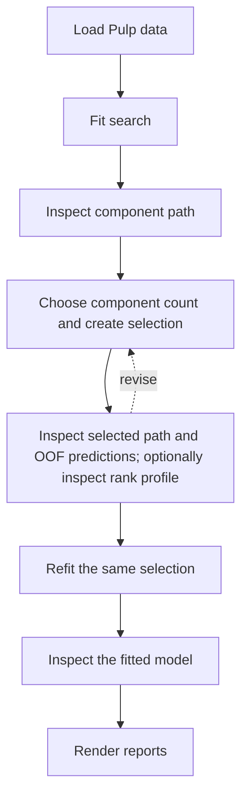

# Pulp: a complete Π-PLS workflow

This tutorial applies [Inspect a manually selected Π-PLS model with synthetic data](synthetic.md)
to a real multivariate dataset. It assumes that `PiPLSSearchCV`, `component_path_`, and fixed-model
fitting are already familiar. The focus is what changes with real data: an interior predictor-rank
result, selection-conditioned out-of-fold (OOF) predictions, and interpretation of an accepted
model.

For ordinary programming use, Π-PLS can be approached like PLS: the main model-complexity
parameter is the paired-mode count $h$ (`n_components`). A **component path** is the
one-dimensional sequence of cross-validated prediction errors obtained as $h$ is varied. For each
$h$, the search resolves the retained predictor rank $r_\pi$ internally, so users do not normally
need to tune a second parameter. Advanced users can inspect or constrain $r_\pi$ when the scientific
question or available sample support makes that useful.

The workflow is to load the Pulp data, fit the search, inspect the component path, choose a component
count and create one selection, inspect the selected path and OOF predictions, optionally inspect the
conditional predictor-rank profile, refit the same selection, inspect the fitted model, and render
the reports. If the selected evidence is unsatisfactory, return to the selection step before
refitting.



## Setup

Install the example dependencies before running the analysis from a source checkout:

```bash
python -m pip install ".[examples]"
```

The example imports the estimators, repeated cross-validation, numerical inspection functions,
Matplotlib, and `adjustText`, then defines the output location and validation splitter:

```python
--8<-- "examples/04_pulp_real_data.py:pulp-tutorial-setup"
```

The component count is intentionally absent from this setup block. It is introduced only after the
component path has been inspected. The pointwise diagnostic figures and RMSE summary include all
eight response columns.

## The data and modeling question

The package-owned dataset contains 46 thermomechanical-pulp samples, 14 fiber-description
predictors, and eight responses comprising Canadian Standard Freeness and seven handsheet
properties. `load_pulp()` reads the installed resources without network access. The matrices are
adapted from supplementary material associated with Lindström et al. (2025); all rows are preserved,
and no imputation or learned preprocessing is applied before fitting. See the
[dataset description](../datasets.md#pulp-real-data-integration) and the [reference](#reference) for
provenance.

Predictor labels retain the source notation: `L` is contour length, `W` is width, `C` is the source
FiberLab C descriptor, and `F` is fibrillation. The suffixes `arith`, `lw`, and `llw` denote
arithmetic, length-weighted, and length-length-weighted means. The response labels are `CSF`
(Canadian Standard Freeness), `Density`, `TI` (tensile index), `Elongation`, `TEA` (tensile
energy absorption), `TSI` (tensile stiffness index), `Tear index`, and `s` (light-scattering
coefficient).

The final accepted analysis below uses three paired latent modes. Its predictor rank is resolved
conditionally by the search at that component count rather than chosen as a routine second tuning
parameter. The distinction is summarized in
[Interpretation of the ranks](../theory.md#interpretation-of-the-ranks).

## Load the data

The named loader returns immutable matrices together with scientific predictor and response labels:

```python
--8<-- "examples/04_pulp_real_data.py:load-pulp-data"
```

The resulting arrays have shapes `(46, 14)` and `(46, 8)`. The same loader works from a source
checkout, wheel, or source distribution and applies no preprocessing.

## Fit the search and inspect the component path { #retrieve-selection-evidence }

Fit the search and retrieve the conditioned component path without creating a selection:

```python
--8<-- "examples/04_pulp_real_data.py:inspect-pulp-component-path"
```

The search evaluates admissible paired-mode counts $h$ and conditionally retains one predictor
rank $r_\pi$ at each count. The resulting `component_path_` is therefore the PLS-like,
one-parameter view: cross-validated prediction error versus `n_components`, with the internal
predictor-rank choice already incorporated into each row.

This analysis uses ten repeated five-fold partitions, so every evaluated candidate is assessed on 50
materialized validation splits. These search-owned results can be inspected without fitting a final
model.

Repeated CV makes this complete analysis approximately ten times as expensive as the former single
five-fold partition. The quick start remains deliberately lighter.

Define a local component-path plotter once, then render the path before fixing a component
count:

```python
--8<-- "examples/04_pulp_real_data.py:define-pulp-component-path-plotter"
```

```python
--8<-- "examples/04_pulp_real_data.py:plot-pulp-component-path"
```


The mean CV-MSE falls substantially through three components and is nearly flat thereafter. The
bars show one population standard deviation across the materialized validation splits on either
side of each mean. They describe split-to-split variability; they are not confidence intervals and
do not enter selection. No row is marked in this first figure because it supplies the evidence for
the component-count decision.

## Choose the component count and create the selection

After inspecting the path, record the chosen count and create the corresponding immutable row:

```python
--8<-- "examples/04_pulp_real_data.py:choose-pulp-selection"
```

Setting `CHOSEN_N_COMPONENTS=3` and calling `search.select(...)` are one conceptual operation. The
static example records the resulting choice so the analysis is reproducible. In an interactive
analysis, inspect the first path figure, set the value, and rerun from this selection stage.

Manual selection is not the only supported component-count rule.
`search.select(rule="best_score")` returns the conditioned path row with the best configured
score, while `search.select(rule="minimum_cv_mse")` returns the smallest component count within
the supplied relative and absolute tolerances of the exact path minimum. With the default scorer,
maximizing the configured score is equivalent to minimizing mean response-standardized CV-MSE.
This tutorial uses manual selection because the purpose is to inspect the path before fixing $h$;
the named rules operate on the same one-dimensional conditioned path and do not require the user to
select $r_\pi$ separately.

## Inspect the selected path and optional conditional rank profile

Retrieve the predictor-rank evidence conditional on the chosen component count. This is optional
advanced inspection; the same `path` object is reused for the selected presentation:

```python
--8<-- "examples/04_pulp_real_data.py:inspect-pulp-selected-evidence"
```

The selected path is numerically identical to the first path; the second presentation adds the
orange chosen-row marker. The profile exposes the evaluated predictor ranks at the selected
component count.

### Selected component path

```python
--8<-- "examples/04_pulp_real_data.py:plot-pulp-selected-component-path"
```


The orange diamond marks the selected three-component row. Its stored predictor rank is 9. With
the default scorer and the default machine-scale predictor-rank tolerance, the exact reference
optimum and the retained predictor rank coincide at 9 for this analysis.

### Optional: conditional predictor-rank profile

```python
--8<-- "examples/04_pulp_real_data.py:plot-pulp-rank-profile"
```


Most users can stop at the component path. Advanced users can inspect this profile because
Π-PLS exposes the second parameter $r_\pi$ rather than hiding it inside the implementation. With
the default scorer, `profile.reference_selection` identifies the exact minimum-CV-MSE predictor
rank at the chosen $h$, whereas `profile.selection` identifies the smallest evaluated rank admitted
by the configured predictor-rank tolerance. The default relative tolerance is at machine scale, so
these normally coincide; both are rank 9 in this analysis.

For these 46 rows, 14 predictors, and repeated five-fold CV, the default statistical-support rule
with `samples_per_predictor_rank=5` gives
$r_{\pi,\mathrm{max}}=\min[14,35,\lceil46/5\rceil]=10$. The support parameter is configurable. For
example, `samples_per_predictor_rank=10` would replace the last term by $\lceil46/10\rceil=5$,
giving a more conservative scan that requires roughly twice as many supplied observations per
retained predictor-rank unit under this heuristic. The dimensional and foldwise numerical-rank caps
still apply.

Ranks 9 and 10 have mean CV-MSE values of approximately 0.258 and 0.274, with population split SDs
of approximately 0.097 and 0.100. Their mean difference is small relative to the displayed
split-to-split variability. The profile supports rank 9 for this selection, but it does not
establish a distinct scientific advantage over nearby retained dimensions. The fixed model still
contains three paired latent modes; predictor rank 9 is the retained predictor-subspace dimension
used to estimate those modes.

Advanced analyses can also control predictor rank directly: `predictor_rank_values` can restrict or
fix the ranks considered by `PiPLSSearchCV`, and an exact
`PiPLSRegression(n_components=h, predictor_rank=r_pi)` pair can be fitted when both ranks are chosen
deliberately. The 50-split protocol is a final stability choice rather than a recommended
development default; a single seeded five-fold partition is much cheaper while the workflow is
being assembled. See [Computational
performance](../computational_performance.md#develop-with-a-smaller-validation-protocol)
for that development-to-final distinction and [Path-selection details](../path_analysis.md) for
selection rules, predictor-rank policies, tolerances, and bounds.

## Inspect selection-conditioned OOF behavior

The OOF report consumes the exact selection already inspected above rather than resolving the
component count again:

```python
--8<-- "examples/04_pulp_real_data.py:pulp-oof-predictions"
```

`oof_report()` reuses the exact 50 seeded splits materialized during path evaluation and recomputes
row-ordered predictions for `selection`. Each observation is held out once per repetition, so the
report averages ten OOF predictions for every Pulp row and records a prediction count of ten. The
fixed random seed makes the repeated partitions reproducible while avoiding fold assignments
determined by row order. Replace the search splitter with a grouped, temporal, or otherwise
appropriate protocol when the sampling design carries experimental structure.

Convert those predictions to an immutable diagnostic result before refitting:

```python
--8<-- "examples/04_pulp_real_data.py:pulp-oof-inspection-results"
```

!!! important "Validation scope"
    These are **selection-conditioned OOF predictions**. The selected rank pair is fitted on each
    stored training fold, but the same observations were already used to inspect the selection path.
    This report is additional evidence within model selection, not independent qualification of the
    selected model. Nested cross-validation or an external test set is required for an independent
    estimate of post-selection performance. See
    [ordered out-of-fold predictions](../path_analysis.md#ordered-out-of-fold-predictions).

The pointwise figures show all eight response columns. This makes the displays denser, but preserves
the full multivariate response structure instead of selecting a visually convenient subset. All
charts use named arrays from `PredictionDiagnostics` directly.

### Observed versus predicted

```python
--8<-- "tools/render_pulp_tutorial.py:render-pulp-observed-vs-predicted"
```


The response series differ in how tightly they follow the identity line. The figure shows all eight
responses, and every series remains selection-conditioned rather than an independent-test result.

See [Observed versus predicted](../model_inspection.md#observed-versus-predicted).

### Residual versus predicted

```python
--8<-- "tools/render_pulp_tutorial.py:render-pulp-residuals-vs-predicted"
```


No dominant global curvature is apparent across the displayed responses. The zero line is
descriptive; it does not establish a formal variance model or calibration claim.

See [Residuals versus predicted](../model_inspection.md#residuals-versus-predicted).

### Standardized RMSE

```python
--8<-- "tools/render_pulp_tutorial.py:render-pulp-standardized-rmse"
```


Response-wise RMSE is divided by the observed sample standard deviation. `CSF` has the lowest value
(approximately 0.30), while `Tear index` has the highest (approximately 0.68). These values are not
identical to the fold-local standardized losses used during path selection.

See [Standardized RMSE](../model_inspection.md#standardized-rmse).

If the selected path, conditional rank profile, or OOF behavior is unsatisfactory, return to
`CHOSEN_N_COMPONENTS`, create another selection, and inspect the resulting evidence. That feedback
step remains part of model selection; it does not turn the same-search OOF report into an independent
performance estimate.

## Refit the accepted selection

After the selection evidence has been examined, fit the exact same selection on all 46 development
observations:

```python
--8<-- "examples/04_pulp_real_data.py:fit-pulp-model"
```

`refit(selection=selection)` does not repeat the component-count decision. It validates the supplied
selection against the fitted search, fits its fixed component and predictor ranks, and attaches the
exact immutable object as `model.selection_` after fitting succeeds. The returned
[`PiPLSRegression`](../api/regression.md#pipls.PiPLSRegression) supplies predictions and fitted-model
inspection, while the search continues to own the cross-validation evidence.

## Compute immutable fitted-model results

The fitted estimator is converted to numerical result objects before the fitted-model figures are
rendered:

```python
--8<-- "examples/04_pulp_real_data.py:pulp-fitted-model-inspection-results"
```

| Result | Question answered |
|---|---|
| `LatentStructure` | How are samples and variables represented by the fitted PLS-family model? |
| `PiPLSDisplayFactors` | What are the Π-PLS-specific $\mathbf{P}$, $\mathbf{D}$, $\mathbf{Q}$, and $\mathbf{Q}\mathbf{D}$ factors? |

The Pulp workflow uses `response_names.index("TI")` as the response sign anchor and requests a
positive orientation. The resulting TI entry is nonnegative for every displayed component, and the
same component sign is applied to the paired columns of $\mathbf{P}$ and $\mathbf{Q}$. This
convention is useful here because tensile index is the principal controlled target. It only chooses
how an equivalent factorization is displayed; it does not change predictions or assert that every
physical effect on TI is positive. If an anchored entry were exactly zero, the helper would use its
default predictor-based sign for that component.

At this point all numerical analysis is complete. The remaining fitted-model code only renders
completed public result objects. The full catalogue is in
[Model inspection](../model_inspection.md).

## Interpret representative fitted-model plots

Factor signs are arbitrary, so paired quantities may change sign together without changing
predictions. This tutorial fixes that ambiguity with the TI-positive convention above. Interpret
relative patterns and paired quantities rather than treating the chosen sign as a fitted scientific
conclusion.

### Standard PLS-family latent structure

#### Score-loading biplot

`biplot_coordinates()` supplies balanced numerical coordinates. Matplotlib draws samples and
predictor arrows, and [`adjustText`](https://adjusttext.readthedocs.io/) moves the labels after
the axis has been configured:

```python
--8<-- "tools/render_pulp_tutorial.py:render-pulp-biplot"
```


The three length descriptors point in closely similar directions in the displayed plane, while
`Shives` contrasts with several C descriptors. These are loading-pattern relationships under the
chosen biplot scaling, not regression coefficients or formal variable importance.

See [Score-loading biplot](../model_inspection.md#score-loading-biplot) and
[`biplot_coordinates()`](../api/inspection.md#pipls.inspection.biplot_coordinates).

### Π-PLS-specific factorization

#### Predictor directions $\mathbf{P}$

The grouped bars are constructed directly from `factors.predictor_directions`:

```python
--8<-- "tools/render_pulp_tutorial.py:render-pulp-predictor-directions"
```


The dominant entries differ by component: the first direction emphasizes `Shives` and selected
fibrillation or length descriptors, the second emphasizes length descriptors, and the third is
strongly associated with `Fines B`. Only relative within-component patterns should be interpreted;
the displayed orientation is fixed by the TI entries in the paired response directions.

The columns of $\mathbf{P}$ are orthonormal predictor directions, and the corresponding columns of
$\mathbf{Q}$ are orthonormal response directions. The diagonal matrix $\mathbf{D}$ pairs and
scales these directions in $\mathbf{P}\mathbf{D}\mathbf{Q}^{\mathsf T}$. The predictor directions
are distinct from ordinary X loadings. The figure shows all three selected paired latent modes;
predictor rank 9 does not create nine plotted modes. See
[Predictor directions](../model_inspection.md#predictor-directions) and
[Diagonal latent coupling](../theory.md#diagonal-latent-coupling).

#### Weighted response directions $\mathbf{Q}\mathbf{D}$

The grouped bars are constructed directly from `factors.weighted_response_directions`:

```python
--8<-- "tools/render_pulp_tutorial.py:render-pulp-weighted-response-directions"
```


The first component has its largest absolute entries for `TI`, `TEA`, `Tear index`, and `TSI`.
The second component is most pronounced for `Tear index` and `s`, while the third contrasts `CSF`
with `Elongation`. Because column $k$ of $\mathbf{Q}\mathbf{D}$ is $D_kQ_{:k}$, it combines each
response direction with the dilation of its paired latent mode and shows orientation and strength
rather than $\mathbf{Q}$ alone.

The complete example includes separate $\mathbf{D}$ and $\mathbf{Q}$ plots in the same
four-panel Π-PLS factorization figure. See [Dilation](../model_inspection.md#dilation),
[Response directions](../model_inspection.md#response-directions), and
[Weighted response directions](../model_inspection.md#weighted-response-directions).

## Inspect the final fitted model

The selection-conditioned OOF section above asks how the accepted selection behaves under the
stored validation splits. After refitting, a different question is useful: how closely does the
single final model fitted to all 46 development observations represent those same observations?
Compute prediction diagnostics from the fitted values while preserving that provenance explicitly:

```python
--8<-- "examples/04_pulp_real_data.py:pulp-final-fit-diagnostics"
```

!!! important "Training-fit scope"
    These figures describe the model fitted to the same 46 observations shown in the plots. They
    are **not** estimates of out-of-sample predictive performance. Use the selection-conditioned
    OOF section for same-search diagnostic evidence, and use nested cross-validation or an external
    test set when independent post-selection performance is required.

### Standardized observed versus fitted responses

Each response is centered and scaled by its observed sample standard deviation, so all eight Pulp
responses can share one coordinate system. The identity line represents exact agreement between
standardized observed and fitted values.


The common scale makes relative scatter around the identity line comparable across responses even
though their original physical units differ. This is a fitted-model representation diagnostic;
points close to the identity line do not by themselves establish external predictive accuracy.
See [Observed versus predicted](../model_inspection.md#observed-versus-predicted).

### Response-wise fitted $R^2$

The coefficient of determination is calculated separately for each response from the final fitted
values:

\begin{equation}
R_j^2 = 1 -
\frac{\sum_i (y_{ij}-\hat y_{ij})^2}
     {\sum_i (y_{ij}-\bar y_j)^2}.
\end{equation}


For this selected model, the fitted $R^2$ values are approximately 0.81--0.96 across the eight
responses. These values summarize training fit only; they should not be compared directly with an
independent-test or nested-CV performance estimate as if the provenance were the same. See
[Response-wise coefficient of determination](../model_inspection.md#response-r2).

### Standardized residual distribution

Pooling response-standardized residuals gives one compact view of the shape of the final-fit
residual distribution. The histogram uses a fixed binning, and the overlaid normal density is
matched to the pooled residual mean and sample standard deviation.


The reference curve is descriptive rather than a normality test. Pooling also compresses
response-specific structure into one distribution, so response-level residual plots remain the
appropriate follow-up when a particular response needs closer diagnosis.

The complete numbered example writes the same three diagnostics as caller-owned PDFs at the end of
its report:

```python
--8<-- "examples/04_pulp_real_data.py:plot-pulp-final-fit-diagnostics"
```

## Reproduce this tutorial

The analysis and selection snippets are maintained in `examples/04_pulp_real_data.py`. The repeated
search is the deliberately expensive tutorial workflow; run the complete example from the repository
root:

```bash
python examples/04_pulp_real_data.py
```

Standalone interpretation-figure recipes are maintained in `tools/render_pulp_tutorial.py`.
`make docs-figures` regenerates the twelve representative single-chart SVGs displayed here, while
the numbered example writes ten caller-owned PDFs with additional score, loading, factorization,
and coefficient views. Both routes calculate their figures directly from in-memory results. See
[Documentation reproducibility](../reproducibility.md#documentation-reproducibility) for the
strict documentation-build and source-distribution checks.

## Next steps

- Use [Model inspection](../model_inspection.md) for the complete quantity catalogue and
  interpretation boundaries.
- Use [Path-selection details](../path_analysis.md) for nondefault bounds, policies, pipelines,
  scorer behavior, grouped or temporal splitters, OOF coverage, and automatic refitting.
- Use [Examples](../examples.md) for Sugarcane, Tobacco, and the ordinary-PLS path comparison.
- Use the [`PiPLSSearchCV` reference](../api/path.md#pipls.PiPLSSearchCV) and
  [inspection API](../api/inspection.md) for exact signatures.

## Reference

Stefan B. Lindström, Rita Ferritsius, Johan E. Carlson, Johan Persson, and Fritjof Nilsson,
“Predicting handsheet properties and enhancing refiner control using fiber analyzer data and
latent variable modeling,” *Computers & Chemical Engineering* **199** (2025), 109143,
[doi:10.1016/j.compchemeng.2025.109143](https://doi.org/10.1016/j.compchemeng.2025.109143).
