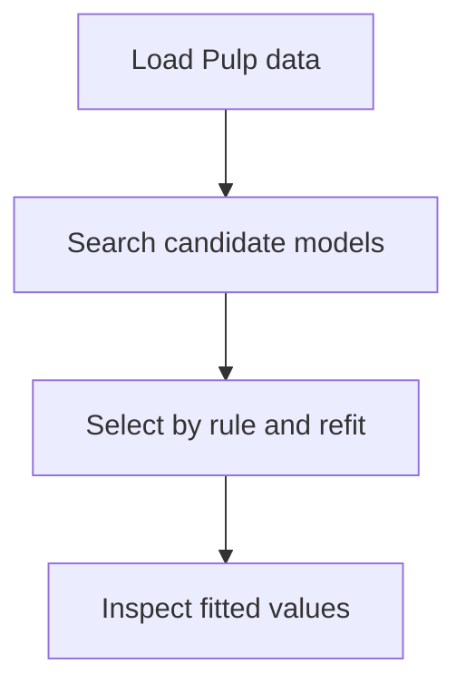

# Quick start with Pulp

This tutorial fits a selected Pi-PLS model to the package-owned Pulp dataset and produces one
observed-versus-fitted plot. It is the shortest installed-package route from data to a usable final
model.

The workflow is to load the Pulp data, search the candidate models, select by rule and refit on all
observations, and then inspect fitted values.



## Load the data

`load_pulp()` returns the predictor matrix, response matrix, labels, sample identifiers, and
provenance in one immutable dataset object:

```python
--8<-- "examples/01_pulp_quick_start.py:load-pulp-data"
```

The dataset contains 46 pulp samples, 14 fiber-description predictors, and eight pulp or handsheet
responses.

## Search, select, and refit

The complete automatic workflow is one chained expression. `fit()` evaluates the cross-validated
path, and `refit(rule="minimum_cv_mse")` selects the smallest component count within the default
machine-scale tolerance of the minimum mean CV-MSE and fits that fixed model on all observations:

```python
--8<-- "examples/01_pulp_quick_start.py:fit-selected-pulp-model"
```

The returned object is an ordinary fitted `PiPLSRegression`. It owns prediction and fitted-model
inspection; the temporary search object is discarded because this workflow does not inspect the
selection evidence.

## Plot all responses on one scale

The eight responses have different units. `prediction_diagnostics()` standardizes each response
using the observed response mean and standard deviation, so all fitted values can share one axis:

```python
--8<-- "examples/01_pulp_quick_start.py:plot-standardized-fitted-values"
```


The diagonal marks exact agreement. The displayed RMSE is the mean of the eight response-wise
standardized fitted RMSE values.

!!! important "Fitted values are not predictive validation"

    These predictions are calculated for the same observations used to fit the final model. The
    figure describes calibration fit. It is not an out-of-fold or external-test assessment.

## Retain the search when evidence matters

Keep the fitted search in a variable when you want to inspect the component path, choose a component
count manually, or request selection-conditioned OOF diagnostics:

```python
search = PiPLSSearchCV().fit(X, Y)
path = search.component_path_
selection = search.select(rule="minimum_cv_mse")
rank_profile = search.predictor_rank_profile(selection.n_components)
report = search.oof_report(X, Y, selection=selection)
model = search.refit(X, Y, selection=selection)
```

This longer route inspects and optionally qualifies one immutable row before fitting the final
model. The same `selection` configures both OOF reporting and refitting, while `model.selection_`
records that exact provenance after the full-data fit succeeds.

Continue with [Inspect and select with synthetic data](synthetic.md) for a manual component choice
and independent-test prediction. The [complete Pulp analysis](pulp.md) adds selection-conditioned
OOF diagnostics and fitted-model interpretation.

## Reproduce this tutorial

The maintained calculation is `examples/01_pulp_quick_start.py`, and the code blocks above are
checked snippets from that file. From a source checkout, `make docs-figures` regenerates the SVG and
`make docs` builds the strict documentation site.
