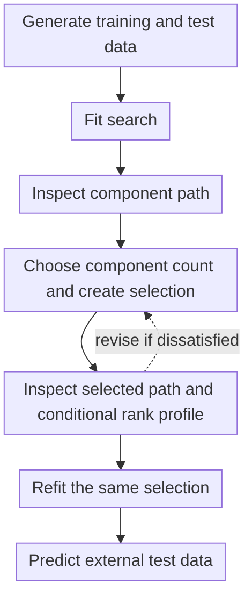

# Inspect and refit a manually selected Pi-PLS model

This tutorial expands the [Pulp quick start](quick_start.md) by retaining the fitted search object,
inspecting its component path before choosing a component count, creating one explicit selection,
and passing that same immutable selection to the final full-data refit. Deterministic synthetic
training and test data make the latent structure known and keep prediction assessment independent
of model selection. For Pi-PLS, `n_components` is the number of paired latent modes.

The workflow is to generate independent training and test data, fit the search, inspect the
component path, choose a component count and create one selection, inspect the selected path and
conditional predictor-rank profile, refit the same selection, and predict the external test data.
If the selected evidence is unsatisfactory, return to the selection step before refitting.



The tutorial deliberately stops after one prediction plot. Scores, loadings, Pi-PLS factorization
plots, and selection-conditioned OOF diagnostics are introduced in the
[complete Pulp tutorial](pulp.md).

## Define the validation splitter

The component path uses reproducible shuffled five-fold cross-validation. The splitter definition
is shown explicitly because it determines every fold-level fit and every CV-MSE value below:

```python
--8<-- "examples/02_synthetic_path_selection.py:import-synthetic-kfold"
--8<-- "examples/02_synthetic_path_selection.py:define-synthetic-cv"
```

For grouped, blocked, or ordered observations, replace `KFold` with a splitter that represents the
sampling design rather than shuffling those structures.

## Generate training and test data

The generator creates two independent sample blocks from one latent model:

```python
--8<-- "examples/02_synthetic_path_selection.py:generate-synthetic-data"
```

The generating structure contains:

- two shared directions that affect both predictors and responses;
- two predictor-specific directions that affect only the predictors;
- one response-specific direction that affects only the responses.

The shared dimension, and therefore the intended predictive paired-mode count, is two, while the
predictor block contains four structured directions in total. These known values help interpret the
example, but cross-validation is not required to recover them exactly in a finite noisy sample.

## Fit the search

The search evaluates admissible pairs of paired-mode count $h$ (`n_components`) and retained
predictor-subspace dimension $r_\pi$ (`predictor_rank`):

```python
--8<-- "examples/02_synthetic_path_selection.py:fit-synthetic-search"
```

For each paired-mode count, the component path retains the evaluated predictor rank with the
smallest mean response-standardized CV-MSE:

\begin{equation}
r_\pi^*(h)
=
\operatorname*{arg\,min}_{r_\pi}
\operatorname{CV\text{-}MSE}(h,r_\pi).
\end{equation}

At this stage the search owns validation evidence. It has not selected a component count or fitted
a final model on all training observations.

## Inspect the component path { #retrieve-selection-evidence }

Retrieve the component path without creating a selection:

```python
--8<-- "examples/02_synthetic_path_selection.py:inspect-synthetic-component-path"
```

Define a local component-path plotter once, then render the unconditional path:

```python
--8<-- "examples/02_synthetic_path_selection.py:define-synthetic-component-path-plotter"
```

```python
--8<-- "examples/02_synthetic_path_selection.py:plot-synthetic-component-path"
```


The mean CV-MSE falls markedly from one to two components and changes little at three. The bars
show one population standard deviation across the materialized validation splits on either side
of each mean. They describe split-to-split variability; they are not confidence intervals and do
not enter selection. No row is marked because the purpose of this first figure is to support the
component-count decision.

## Choose the component count and create the selection

After inspecting the path, record the chosen value and create the corresponding immutable search
selection:

```python
--8<-- "examples/02_synthetic_path_selection.py:choose-synthetic-selection"
```

Setting `CHOSEN_N_COMPONENTS` and calling `search.select(...)` are one conceptual operation. The
static script records the resulting choice so that the complete example is reproducible. In an
interactive analysis, inspect the first path figure, set the value, and rerun from this selection
stage.

## Inspect the selected evidence

Retrieve the predictor-rank profile conditional on the chosen component count. The same `path`
object is reused for the selected presentation:

```python
--8<-- "examples/02_synthetic_path_selection.py:inspect-synthetic-selected-evidence"
```

`selection` is the complete immutable row $[h,r_\pi^*(h)]$. These search-owned results can be
inspected without fitting a final model. The selection will be passed unchanged to `refit()` if the
evidence is accepted.

### Selected component path

```python
--8<-- "examples/02_synthetic_path_selection.py:plot-synthetic-selected-component-path"
```


The path is unchanged; the orange diamond identifies the selected two-component row. Showing the
path again makes the recorded decision explicit without implying that path evaluation was repeated.

### Conditional predictor-rank profile

```python
--8<-- "examples/02_synthetic_path_selection.py:plot-synthetic-rank-profile"
```


The orange diamond marks the selected predictor rank. At two components, the lowest evaluated
mean CV-MSE occurs at predictor rank four. In this
controlled example, that matches the two shared and two predictor-specific directions in the
predictor block. This agreement is informative but not a general selection guarantee.

The selected path and rank profile are still model-selection evidence. If they make the chosen
component count unsatisfactory, revise `CHOSEN_N_COMPONENTS` and create a new selection. This is a
return within the selection process, not independent post-selection validation.

## Refit the selected pair

The final estimator consumes the accepted selection:

```python
--8<-- "examples/02_synthetic_path_selection.py:refit-synthetic-model"
```

`refit(selection=selection)` does not resolve the component choice again. It verifies that the
selection belongs to the fitted search, fits its exact component-count and predictor-rank pair on
all training observations, and attaches the same immutable object as `model.selection_` after the
fit succeeds. The search remains the owner of the path evidence; the returned estimator owns
prediction and fitted-model inspection.

## Evaluate independent predictions

Predictions are calculated for the independent test observations after the selected pair has been
refitted on all training data:

```python
--8<-- "examples/02_synthetic_path_selection.py:evaluate-synthetic-predictions"
```

The completed diagnostic result is then rendered:

```python
--8<-- "examples/02_synthetic_path_selection.py:plot-synthetic-predictions"
```


The prediction plot uses the held-out test block, so it is not a fitted-data or
selection-conditioned OOF display. `model.score(test.X, test.Y)` supplies the corresponding uniform
average of the response-wise coefficients of determination.

## Minimal reusable workflow

For ordinary manual selection, the essential sequence is:

```python
from sklearn.model_selection import KFold

from pipls import PiPLSSearchCV

cv = KFold(n_splits=5, shuffle=True, random_state=0)
search = PiPLSSearchCV(cv=cv).fit(X_train, Y_train)

path = search.component_path_
# Inspect path before assigning chosen_n_components.
selection = search.select(n_components=chosen_n_components)
selected_path = search.component_path_
rank_profile = search.predictor_rank_profile(selection.n_components)
# Inspect selected_path and rank_profile; revise selection if needed.

model = search.refit(
    X_train,
    Y_train,
    selection=selection,
)
Y_pred = model.predict(X_test)
```

Use `model.selection_` to inspect the fitted estimator's retained provenance after refitting. Use
the pre-existing `selection` as the workflow handoff whenever search evidence, OOF reporting, and
final refitting must refer to exactly the same row.

## Continue with real data

The [complete Pulp tutorial](pulp.md) adds selection-conditioned OOF predictions, immutable
inspection objects, standard PLS-family plots, and Pi-PLS-specific factorization plots.

For exact signatures and advanced behavior, see:

- [`PiPLSSearchCV`](../api/path.md#pipls.PiPLSSearchCV);
- [`PiPLSRegression`](../api/regression.md#pipls.PiPLSRegression);
- [Path-selection details](../path_analysis.md).

## Reproduce this tutorial

The executable calculation is maintained in `examples/02_synthetic_path_selection.py`, and the
code blocks above are checked snippets from that file. From a source checkout, `make docs-figures`
regenerates the four SVG figures and `make docs` regenerates them before building the strict site.
See [Documentation reproducibility](../reproducibility.md#documentation-reproducibility) for the
required dependencies and distribution-level checks.
