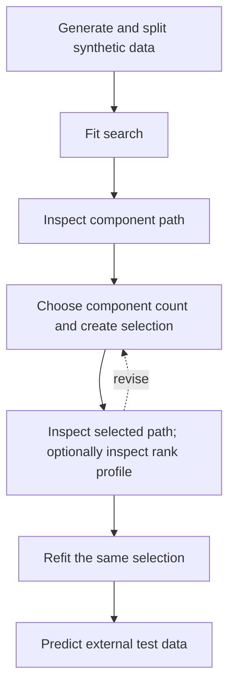

# Inspect and refit a manually selected Π-PLS model

This tutorial continues the workflow introduced in the [Pulp quick start](quick_start.md), but uses
deterministic synthetic data split into training and test rows so that the latent structure is known
and prediction assessment remains independent of model selection. It inspects
the validation evidence before choosing a component count, creates one explicit selection, and passes it to the final full-data refit.

For programming use, the main complexity parameter is `n_components`, denoted by $h$. The
**component path** records cross-validated prediction error as $h$ varies, with predictor rank
$r_\pi$ resolved internally at each $h$. See
[Interpretation of the ranks](../theory.md#interpretation-of-the-ranks).

The workflow is to generate synthetic data, split its rows into training and test blocks, fit the
search, inspect the component path, choose a component count and create one selection, optionally inspect the
conditional predictor-rank profile, accept the selection, refit that same selection, and predict the
external test data. If the selected path or conditional rank evidence is unsatisfactory, return to
the selection step before accepting it.



The tutorial deliberately stops after one prediction plot. Scores, loadings, Π-PLS factorization
plots, and selection-conditioned OOF diagnostics are introduced in the
[complete Pulp tutorial](pulp.md).

## Define the validation splitter

The component path uses reproducible shuffled five-fold cross-validation. The splitter definition
is shown explicitly because it determines every fold-level fit and every CV-MSE value below:

```python
--8<-- "examples/02_synthetic_path_selection.py:import-synthetic-kfold"
--8<-- "examples/02_synthetic_path_selection.py:define-synthetic-cv"
```

For grouped, blocked, or ordered observations, replace `KFold` with a splitter that represents the
sampling design rather than shuffling those structures.

## Generate and split synthetic data

Generate one reproducible synthetic `X, Y` pair and split its rows into training and test blocks:

```python
--8<-- "examples/02_synthetic_path_selection.py:generate-synthetic-data"
```

The details of the synthetic data generation are not important for learning Π-PLS regression analysis, but the generating structure contains:

- two shared directions that affect both predictors and responses;
- two predictor-specific directions that affect only the predictors;
- one response-specific direction that affects only the responses.

The shared dimension, and therefore the intended predictive paired-mode count, is two, while the
predictor block contains four structured directions in total. These known values help interpret the
example, but cross-validation is not required to recover them exactly in a finite noisy sample.

## Fit the search

Fit the component search just as you would fit a PLS component search:

```python
--8<-- "examples/02_synthetic_path_selection.py:fit-synthetic-search"
```

`n_components` is the quantity displayed on the component path. The conditionally resolved
predictor rank $r_\pi$ is already incorporated into each row; it can be inspected later under
[Optional: inspect the conditional predictor-rank profile](#inspect-conditional-predictor-rank-profile).

At this stage the search owns validation evidence. It has not selected a component count or fitted
a final model on all training observations.

## Inspect the component path { #retrieve-selection-evidence }

The component path is the PLS-like view of model complexity: one row for each evaluated $h$, with
the conditionally resolved predictor rank already incorporated. Retrieve it without creating a
selection:

```python
--8<-- "examples/02_synthetic_path_selection.py:inspect-synthetic-component-path"
```

Define a local component-path plotter once, then render the unconditional path:

```python
--8<-- "examples/02_synthetic_path_selection.py:define-synthetic-component-path-plotter"
```

```python
--8<-- "examples/02_synthetic_path_selection.py:plot-synthetic-component-path"
```


The mean CV-MSE falls markedly from one to two components and changes little at three. The bars
show one population standard deviation across the materialized validation splits on either side
of each mean. They describe split-to-split variability; they are not confidence intervals and do
not enter selection.

## Choose the component count and create the selection

This tutorial makes a **manual visual parsimony choice** from the path: retain two components,
because the mean CV-MSE drops markedly from one to two components and changes little at three. This
is a judgment based on the plotted path, not an automated elbow rule. Record the chosen component
count and create the corresponding immutable search selection:

```python
--8<-- "examples/02_synthetic_path_selection.py:choose-synthetic-selection"
```

The static script records that manual choice so the example is reproducible. For rule-based
selection instead, `search.select(rule="minimum_cv_mse")` retains the smallest component count within
the configured CV-MSE tolerance of the path minimum; see
[Component path and component selection](../path_selection.md#component-path-and-component-selection).

## Inspect the selected evidence

The selected component-path row can be reviewed without fitting a final model. For advanced
inspection, also retrieve the predictor-rank profile conditional on the chosen component count.
The same `path` object is reused for the selected presentation:

```python
--8<-- "examples/02_synthetic_path_selection.py:inspect-synthetic-selected-evidence"
```

`selection` is the complete immutable row $[h,r_\pi(h)]$, where $r_\pi(h)$ is the predictor rank
already resolved by the fitted search. The selection will be passed unchanged to `refit()` if the
evidence is accepted.

### Selected component path

```python
--8<-- "examples/02_synthetic_path_selection.py:plot-synthetic-selected-component-path"
```


The path is unchanged; the orange diamond identifies the selected two-component row without repeating the evaluation.

### Optional: inspect the conditional predictor-rank profile { #inspect-conditional-predictor-rank-profile }

The component path is usually sufficient for the component-count decision. To inspect how the
predictor rank was resolved at the chosen $h$, retrieve the conditional predictor-rank profile:

```python
--8<-- "examples/02_synthetic_path_selection.py:plot-synthetic-rank-profile"
```


The profile shows the predictor ranks actually evaluated at the chosen $h$. With the default
scorer, larger configured scores are equivalent to smaller mean response-standardized CV-MSE.
`reference_selection` identifies the exact minimum-CV-MSE rank, while `selection` identifies the
smallest rank admitted by the fitted predictor-rank tolerance. With the default machine-scale
tolerance these are normally the same. Here both select predictor rank five, one above the four
structured predictor directions in the generating model. Cross-validation targets predictive
performance in the finite noisy sample; it need not recover the generating rank exactly.

Advanced analyses can control predictor rank through the search configuration. See
[Path and selection](../path_selection.md#predictor-rank-policies) for the available policies and tolerances.

The selected path and optional rank profile are the model-selection evidence in this workflow.
If they make the choice unsatisfactory, revise `CHOSEN_N_COMPONENTS` and create a new selection.
Once accepted, keep that immutable selection fixed for final refitting and any later
selection-conditioned OOF diagnosis.

## Refit the selected pair

The final estimator consumes the accepted selection:

```python
--8<-- "examples/02_synthetic_path_selection.py:refit-synthetic-model"
```

`refit(selection=selection)` does not resolve the component choice again. It verifies that the
selection belongs to the fitted search, fits a model with exactly its component count and predictor
rank on all training observations, and attaches the same immutable object as `model.selection_` after the
fit succeeds. The search remains the owner of the path evidence; the returned estimator owns
prediction and fitted-model inspection.

## Evaluate independent predictions

Predictions are calculated for the held-out test rows after the selected pair has been refitted on
all training rows:

```python
--8<-- "examples/02_synthetic_path_selection.py:evaluate-synthetic-predictions"
```

The completed diagnostic result is then rendered:

```python
--8<-- "examples/02_synthetic_path_selection.py:plot-synthetic-predictions"
```


The prediction plot uses the held-out test block. `model.score(X_test, Y_test)` supplies the corresponding uniform
average of the response-wise coefficients of determination.

## Minimal reusable workflow

For ordinary manual selection, the essential sequence is:

```python
from sklearn.model_selection import KFold

from pipls import PiPLSSearchCV

cv = KFold(n_splits=5, shuffle=True, random_state=0)
search = PiPLSSearchCV(cv=cv).fit(X_train, Y_train)

path = search.component_path_
# Inspect path before assigning chosen_n_components.
selection = search.select(n_components=chosen_n_components)
# For rule-based selection instead:
# selection = search.select(rule="minimum_cv_mse")
# Optionally, for advanced inspection:
rank_profile = search.predictor_rank_profile(selection.n_components)
# Inspect the selected evidence; revise selection if needed.

model = search.refit(
    X_train,
    Y_train,
    selection=selection,
)
Y_pred = model.predict(X_test)
```

Use `model.selection_` to inspect the fitted estimator's retained provenance after refitting. Use
the pre-existing `selection` as the workflow handoff whenever search evidence, OOF reporting, and
final refitting must refer to exactly the same row.

## Continue with real data

The [complete Pulp tutorial](pulp.md) adds selection-conditioned OOF predictions, immutable
inspection objects, standard PLS-family plots, and Π-PLS-specific factorization plots.

For exact signatures and advanced behavior, see:

- [`PiPLSSearchCV`](../api/path.md#pipls.PiPLSSearchCV);
- [`PiPLSRegression`](../api/regression.md#pipls.PiPLSRegression);
- [Path and selection](../path_selection.md).

## Reproduce this tutorial

The executable calculation is maintained in `examples/02_synthetic_path_selection.py`, and the
code blocks above are checked snippets from that file. From a source checkout, `make docs-figures`
regenerates the four SVG figures and `make docs` regenerates them before building the strict site.
See [Documentation reproducibility](../reproducibility.md#documentation-reproducibility) for the
required dependencies and distribution-level checks.
